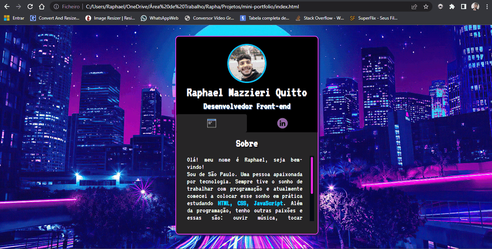
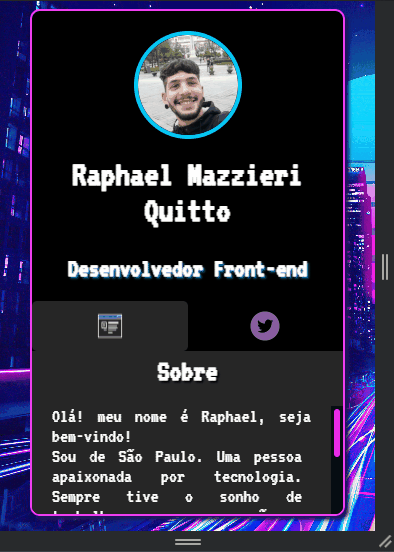

# <strong>Sobre e Objetivo</strong> 🎯

Projeto foi criado como desafio proposto no evento Dev em Dobro, com o intuito de criar um mini-portfolio pessoal, onde falo sobre mim e mostro minhas redes sociais e de aplicar os conceitos aprendidos sobre HTML e CSS intermediários e Javascript básico.

Alguns métodos utilizados no projeto: HTML Semântico; Responsividade e Javascript;

# <strong>Status</strong> 🎯

Projeto mini-portfolio: em andamento 🚧

## Tecnologias

<ul>
    <li>HTML</li>
    <li>CSS</li>
    <li>JAVASCRIPT</li>
    <li>GIT</li>
</ul>

# Dificuldades ⚔

Tive dificuldade moderada com flexbox, pois não compreendia muito bem o conceito deste display e suas propriedades.

A responsividade foi trabalhosa, pois é necessário que o layout seja funcional em todos os tipos de dispositivos. A tecnologia Media Queries facilitou muito o processo 

Javascript foi díficil de compreender de início, pois não estava familiarizado com a sintaxe e estrutura desta linguagem.